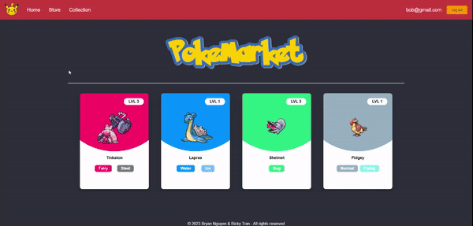

# Poke-Market

## Project Overview

Poke-Market is a web application developed by Bryan Nguyen and Ricky Tran. It allows users to sign up/login to collect four daily Pokemon cards. Users can browse their collection of Pokemon cards and filter through them. Pokemon information is retrieved from the RESTful API, PokeAPI.

### Preview

<!--
<iframe frameBorder='0' width='640' height='360' webkitallowfullscreen mozallowfullscreen allowfullscreen src="https://www.awesomescreenshot.com/video/22868428?key=d85ff5e281a3d036433a1221c7b3f348"></iframe>

<iframe frameBorder='0' width='640' height='360' webkitallowfullscreen mozallowfullscreen allowfullscreen src="https://www.awesomescreenshot.com/video/22868473?key=c2fa5caad2dc0eef694e35e928166666"></iframe>


https://www.awesomescreenshot.com/video/22868382?key=c93b376eb311e3351770fe6d16f923a4

-->





### Features

- User authentication (sign up and login)
- Daily collection of Pokemon cards
- Browse and filter your collection
- Data pulled from PokeAPI

## Setup & Installation

To get started, follow these steps:

1. **Set Up MongoDB Database**: Ensure you have set up your MongoDB database. If you haven't, you can refer to the [MongoDB Atlas documentation](https://www.mongodb.com/atlas/database).

2. **Create a `.env` File**: In the `backend` directory, create a `.env` file with the following variables:

   - `PORT`: This is the port where your backend server will be hosted. Make sure it matches the proxy setting in the `package.json` file in the `frontend` directory.
   - `MONGO_URI`: The connection URI to your MongoDB database.
   - `SECRET`: Create a string to be used in the JWT authentication process.

3. Clone the repository and install dependencies:

```bash
git clone https://github.com/BryanNguyen03/Poke-Market.git
cd Poke-Market
npm install
```

4. Open two different terminals and run the two code blocks separately:

```bash
cd backend
nodemon
```

```bash
cd frontend
npm run build
npm start
```

5. Happy Collecting!
